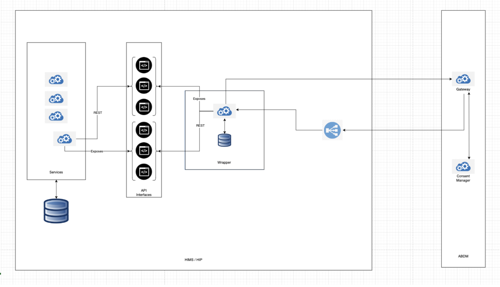

# ABDM Wrapper
The Ayushman Bharat Digital Mission (ABDM) is a government initiative that aims to develop a digital health infrastructure for India. The ABDM aims to improve the efficiency and transparency of healthcare data transfer between patients, medical institutions, and healthcare service providers. It also allows patients to securely store their medical information and share with others as needed.
The National Health Authority (NHA) is implementing Ayushman Bharat Digital Mission (ABDM) to create a digital health ecosystem for the country. ABDM intends to support different healthcare facilities like clinics, diagnostic centers, hospitals, laboratories and pharmacies in adopting the ABDM ecosystem to make available the benefits of digital health for all the citizens of India.
In order to make any digital solution ABDM compliant, it has to go through 3 milestones and obtain AND certification.
- Milestone 1: ABHA Id creation, verification and obtaining link token
- Milestone 2: Linking and exporting health data
- Milestone 3: Sending a consent request and importing data from other applications in the ecosystem

ABDM Wrapper is created to solve the challenges and issues faced by integrators to bring their systems into ABDM ecosystem.
Wrapper aims to abstract complex workflows and algorithms exposing clean and simple interfaces for integrators.
Wrapper abstracts implementation of workflows involved in **Milestone 2** and **Milestone 3**.

## Architecture


Wrapper is a springboot application packaged with mongodb database.
Wrapper can be deployed on existing HMIS's / health facility's infrastructure.

There are sets of interfaces which wrapper exposes and the existing services 
need to invoke them to implement ABDM workflows.

At the same time if HMIS is an HIP, then existing services should expose a set 
of interfaces which wrapper needs to invoke to get information from
health providers.

The callback apis which gateway would be making to wrapper should be behind
facility's firewall.

## Pre-requisites
### 1. Install ABHA SBX PHR App on your mobile.

> https://sandbox.abdm.gov.in/docs/phr_app


### 2. Create ABHA Address

```
* Skip if ABHA Address already exists.

ABHA Address can be created using: 
- Mobile Number
- Aadhaar Number
- E-mail

After creating the ABHA Address, your id should look like "yourAbha@sbx"
```

### 3. System Requirements and Installations:
There are two ways to get wrapper and related applications running on your system:
#### 1. Using docker (Preferred): This is an easy way to get wrapper up and running.
Install docker and docker-compose: You can install docker desktop from [here](https://www.docker.com/products/docker-desktop/) to get both.

System Requirements:
- For Mac, check [here](https://docs.docker.com/desktop/install/mac-install/)
- For Windows, check [here](https://docs.docker.com/desktop/install/windows-install/)
- For Linux, check [here](https://docs.docker.com/desktop/install/linux-install/)

Using default docker-compose.yaml, you can bring up wrapper and mongodb services.
Using compose-wrapper-mockgateway.yaml, you can bring up wrapper, mongodb and mock gateway services.

This repository provides two other services:
- Sample HIP
- Sample HIU

If you need to bring these services up, then you need to install gradle from [here](https://gradle.org/install/)

#### 2. If you are facing issues with installing or running docker, then you can install individual components:
- Install mongodb from [here](https://www.mongodb.com/docs/manual/installation/)
- Install jdk 17. Instructions can be found [here](https://www3.cs.stonybrook.edu/~amione/CSE114_Course/materials/resources/InstallingJava17.pdf)
- Install gradle from [here](https://gradle.org/install/)

System Requirements:
- For Mongodb, you can check [here](https://www.mongodb.com/docs/manual/administration/production-notes/) to understand resource requirements.
- For Java17, you can check [here](https://www.oracle.com/java/technologies/javase/products-doc-jdk17certconfig.html) for compatible system configurations.
- Gradle version >= 8.5 should be fine.

Recommended RAM: Systems with more than 8 GB RAM

### 4. Register bridge (hostUrl) with ABDM for callbacks.
1. Get Access Token.
```
curl --location 'https://dev.abdm.gov.in/gateway/v0.5/sessions' \
--header 'Content-Type: application/json' \
--data '{
    "clientId": <client id provided>,
    "clientSecret": <client secret provided>
}'
```
2. Register bridge url
```
curl --location --request PATCH 'https://dev.abdm.gov.in/gateway/v1/bridges' \
--header 'Authorization: Bearer <your accessToken>' \
--header 'Content-Type: application/json' \
--data '{
    "url": <your bridge url>
}'
```
### 5. Provide your credentials
- Provide clientId and clientSecret in [application.properties](src/main/resources/application.properties)

## Bring the application up.
If you have installed docker and docker compose then you can bring the application using:
```
docker-compose up --build
```

If you have chosen to install separate components, then here is how you can bring the services up:
- Start mongodb (let the port be defaulted to 27017): Instructions on how to start can be found [here](https://www.mongodb.com/docs/v7.0/administration/install-community/)
  The links like `Install on Linux` do have instructions on how to start the service as well.
- Start wrapper then by going to root of this repository and running `gradle bootrun`

## Test Discovery and User-Initiated Linking
Check this [page](https://github.com/NHA-ABDM/ABDM-wrapper/wiki/Test-Discovery-and-User-Initiated-Linking) to get more details on this.

## Test Consent Workflow
Check this [page](https://github.com/NHA-ABDM/ABDM-wrapper/wiki/Test-Consent-Workflow) to get more details on this.

## Test Health Information Exchange
Check this [page](https://github.com/NHA-ABDM/ABDM-wrapper/wiki/Test-HIU-Request-for-health-information) to get more details on this.

## Mock Gateway
In case ABDM sandbox gateway is down, you can use this mock [gateway](https://github.com/NHA-ABDM/ABDM-wrapper/wiki/LightWeight-Gateway) to
test out your workflows:

## Sample HIP
Check this [page](https://github.com/NHA-ABDM/ABDM-wrapper/wiki/Sample-HIP) for more details on this.

## Sample HIU
Check this [page](https://github.com/NHA-ABDM/ABDM-wrapper/wiki/Sample-HIU) for more details on this.

### [Developer Guide](https://github.com/NHA-ABDM/ABDM-wrapper/wiki/Developer-guide)
### [Frequently Faced Issues](https://github.com/NHA-ABDM/ABDM-wrapper/wiki/Frequently-Faced-Issues)